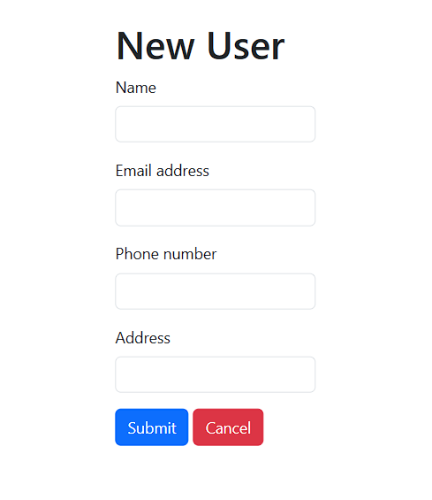

# CRUD {PHP}

This simple CRUD (Create, Read, Update and Delete) project will let anyone getting into PHP have a rough idea how it will look like.

## Preview

Pic: The above picture represents the look of the project

Projet has bare bones styling, which emphasizes the easy approachablility of the project.

## Conclusion

Credit for the original creator : Youtue | "[PHP and MySQL with CRUD Operations: Create, Read, Update, Delete"](https://www.youtube.com/watch?v=NqP0-UkIQS4) by [BoostMyTool](https://www.youtube.com/@BoostMyTool).
